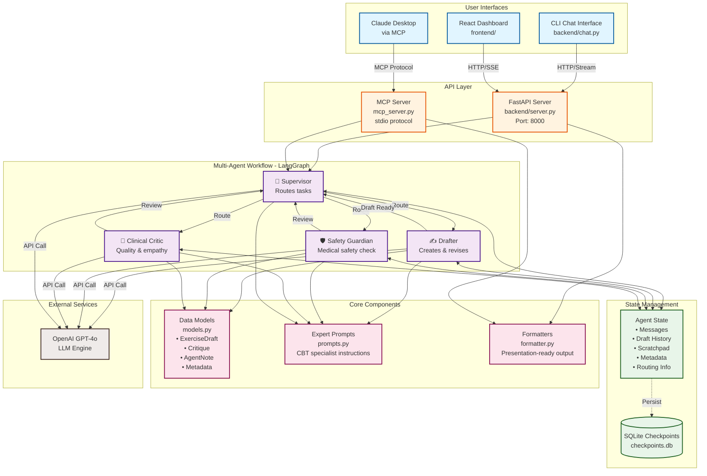

# Cerina Protocol Foundry - Architecture Diagram



## System Flow

### 1. User Request Flow
```
User Input
    ↓
Interface (CLI/Web/Claude)
    ↓
API Layer (FastAPI/MCP)
    ↓
Supervisor Node
    ↓
Routing Decision
```

### 2. Agent Collaboration Cycle
```
Supervisor → Drafter (Create v1)
    ↓
Supervisor → Safety Guardian (Review v1)
    ↓ [If Rejected]
Supervisor → Drafter (Create v2)
    ↓
Supervisor → Safety Guardian (Re-review v2)
    ↓ [If Approved]
Supervisor → Clinical Critic (Review v2)
    ↓ [If Approved]
Supervisor → Human Review
```

### 3. State Updates
```
Each Agent Node:
1. Reads current state
2. Accesses scratchpad notes
3. Reviews draft history
4. Generates output
5. Updates:
   - Draft (if Drafter)
   - Scratchpad (all agents)
   - Metadata scores
   - Last reviewer
6. Returns control to Supervisor
```

## Key Architectural Patterns

### 1. **Supervisor-Worker Pattern**
- Centralized routing logic in Supervisor
- Workers (agents) focus on specific tasks
- State-based decision making

### 2. **Event Sourcing**
- All agent actions logged
- Draft version history maintained
- Scratchpad notes preserved
- Full audit trail

### 3. **Checkpointing**
- State persisted to SQLite
- Crash recovery possible
- Thread-based isolation
- Async operations

### 4. **Interface Abstraction**
- Same workflow, multiple interfaces
- CLI for testing
- Web for visualization  
- MCP for AI integration

## Technology Stack

| Layer | Technology |
|-------|-----------|
| **Backend** | Python 3.11, LangGraph, LangChain |
| **LLM** | OpenAI GPT-4o |
| **State** | TypedDict, Pydantic Models |
| **Persistence** | SQLite (via AsyncSqliteSaver) |
| **API** | FastAPI, Server-Sent Events |
| **Frontend** | React, TypeScript, Vite |
| **Styling** | TailwindCSS |
| **MCP** | mcp-python SDK |

## Data Flow Example

**User:** "Create CBT exercise for social anxiety"

```
1. Input → FastAPI /stream endpoint
2. Initialize State:
   - messages: [HumanMessage]
   - current_draft: None
   - draft_history: []
   - scratchpad: []
   - metadata: ReviewMetadata()

3. Supervisor decides → "drafter"
4. Drafter creates v1
   - Updates: current_draft, draft_history, scratchpad
   - Metadata: total_revisions = 1

5. Supervisor decides → "safety_guardian"
6. Safety reviews v1 → Rejects
   - Updates: critiques, scratchpad
   - Metadata: safety_score = 0.5

7. Supervisor decides → "drafter"
8. Drafter creates v2 (addresses critiques)
   - Reads scratchpad from Safety
   - Updates: current_draft, draft_history
   - Metadata: total_revisions = 2

9. Supervisor decides → "safety_guardian"
10. Safety re-reviews v2 → Approves
    - Updates: critiques, scratchpad
    - Metadata: safety_score = 1.0

11. Supervisor decides → "clinical_critic"
12. Clinical reviews v2 → Approves
    - Updates: critiques, scratchpad
    - Metadata: empathy_score = 1.0, clarity_score = 1.0

13. Supervisor decides → "human_review"
14. Return final state to user

Total: 2 versions, 5 agent actions, full quality validation
```

## Scalability Considerations

- **Async Operations**: All I/O is async
- **Stateless Agents**: Can be scaled horizontally
- **Checkpointing**: Enables pause/resume
- **Thread Isolation**: Multiple users = multiple threads
- **Persistent Storage**: SQLite for development, Postgres for production
